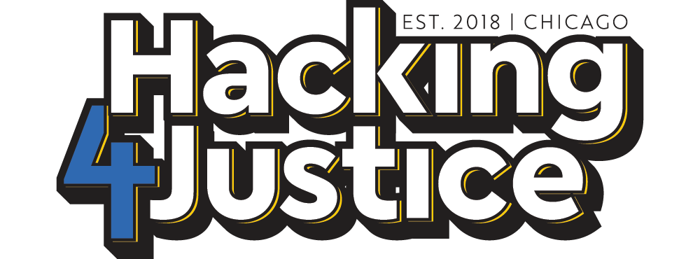

# Hacking 4 Justice Beginner Workshop

Welcome to the [H4J Beginner Workshop](https://hacking4justice.org/learn)! Please read this document carefully, as it will help you prepare and get the most out of your learning experience. In particular, be sure to complete the [workshop prep tasks](#workshop-prep) before our first meeting. The Day One **R Scripts** are also posted in this repository. Here, you will also have the opportunity to share the code you wrote in Day Two.

We always want to keep improving – whether you are a trainer, coach or student, please feel free to use this space to make comments or suggestions. For example, if something didn't make sense to you or your students, you can let us know directly here. Feel free to suggest any alternative strategies you and your team developed to complete the Day One tasks (using base R) – and of course, if there are typos or problems with the tutorial code, please let use know! To trainers and coaches: we recognize there are many ways to teach R, and we follow the pedagogical approach outlined [here](https://github.com/matloff/TidyverseSkeptic/). 

If you are new to GitHub, you can learn the basics of collaboration [here](https://guides.github.com/activities/hello-world/).

## Table of Contents <!-- omit in toc -->
- [Prepare for the Workshop](#workshop-prep)
  - [What is R?](#what-is-r)
  - [Download and Install R](#download-and-install-r)
  - [What is RStudio?](#what-is-rstudio)
  - [Download and Install RStudio](#download-and-install-r)
  - [Download CCSAO Data](#download-ccsao-data)
- [Day One](#day-one)
- [Day Two](#day-two)

## Workshop Prep

In this section, you will learn some basics about R and get ready to dive into work in our first class! If you have any issues with the practical steps in this guide, reach out to your assigned coach or kbourne@berkeley.edu for help. 

### What is R?

R is a programming language. It is a powerful and accessible tool that will help you to understand quantitative data. Unlike other expensive software (e.g. SPSS, STATA), R is free and open-source. The R community is also very supportive, offering help and examples to solve virtually any problem. Beyond this, community members also create and share new packages to increase R functionality.

### Download and Install R

First, you will need to download R on your computer from [CRAN](https://cran.r-project.org/), short for the **C**omprehensive **R** **A**rchive **N**etwork. You will learn more about CRAN in Day One. For now, follow the appropriate links depending if you are on a Mac or Windows machine. For example, a Mac user would click here:

Also be sure to note that the version of R you download is compatible with the operating and processing systems on your machine. For example, for Mac, the most recent version of R (4.3.1 'Beagle Scouts') is compatible with OS X 11 (Big Sur) and higher. Likewise, note whether you have an Intel or Apple M1/M2 processor by clicking on the left-hand Apple icon and 'About This Mac.' If your machine is from 2020 or older, it likely has an Intel processor; newer Macs will have M1 or M2. Download the appropriate version of R for you. 

Once the R setup file is downloaded, follow the instructions to install R on your machine using the default options.

### What is RStudio?

RStudio is an application that makes working with R easier and more fun. RStudio creates a unified interface that will help to stay organized as you work. You must download RStudio in addition to R itself (which you already did above).

### Download and Install RStudio

You can download RStudio [here](https://posit.co/download/rstudio-desktop/). When you click the link, it should recognize the most appropriate version of RStudio for your machine, so simply click on the blue button that looks like this (for Mac users):

Once the RStudio setup file is downloaded:  

Mac users: Move the downloaded setup file to your Applications folder and follow the instructions to install RStudio on your machine, using the default options.

Windows users: Run the downloaded setup file and follow the instructions to install RStudio on your machine, using the default options.

### Download CCSAO Data

In Day One of the workshop, we will focus on the Sentencing table. You can download this dataset [here](https://datacatalog.cookcountyil.gov/Courts/Sentencing/tg8v-tm6u). 

As illustrated above, click "Export" and then "CSV" to download the data as a .csv file. Save this file in a clearly labeled, easily-accesible folder. For example, you might create a folder on your Desktop called "SAO-data." This will help you easily find the data during the Afternoon session of Day One. 

In Day Two, you may choose to look into the Sentencing dataset more deeply, or explore the other [datasets](https://datacatalog.cookcountyil.gov/browse?tags=state%27s%20attorney%20case-level) the CCSAO has made available. If you are interested in a particular table, feel free to download it now as well, following the steps above. Be sure to save it in the same folder as the Sentencing.csv file. 

You should also read through [this guide](https://www.cookcountystatesattorney.org/resources/how-read-data) to the public CCSAO data. Be sure to download the Data Flowchart and Glossary to have an easy reference on-hand.

## Day One 

You will spend Saturday morning creating a small, fictional dataset of your own to learn some of the building blocks of R programming. The whole class will be led by one trainer at a time, as well as dividing into small groups exercises with support from your assigned coach. By the time lunch arrives, you will have learned about the RStudio environment, data types, vectors, data frames, operators, conditional statements, loops, tables and plots.

After lunch, you will apply these skills to the actual SAO Sentencing dataset. Here, you will learn how to install packages from CRAN in order to make R functionality even more powerful. Saturday wraps up with a community dinner as a class.

Key Times on Saturday:
- 8:00am: Doors open, breakfast arrives, participant sign-in begins
- 9:00am: Welcome, Norms, & Participant Introductions
- 9:30am: Modules 1 & 2
- 12:15pm: Lunch & Discussion
- 1:15pm: Modules 3 & 4
- 6:00pm: Dinner & Socializing

## Day Two

On Sunday, you will begin to develop your own research questions that can be answered with the SAO data. After spending several hours doing hands-on research, each group will take turns presenting your findings to the class at large to cement your new analytical skills.

The workshop concludes with ideas for the next steps you can take in your growth as a criminal justice data scientist.

Key Times on Sunday:
- 8:00am: Doors open, breakfast arrives, participant sign-in begins
- 9:00am: Day 2 Intro & Research Topics from the SAO
- 9:30am: Designing Research Questions
- Group-Work Time & Lunch
- 3:00pm: Group Presentations
- 5:15pm: Next Steps & Wrap-up
